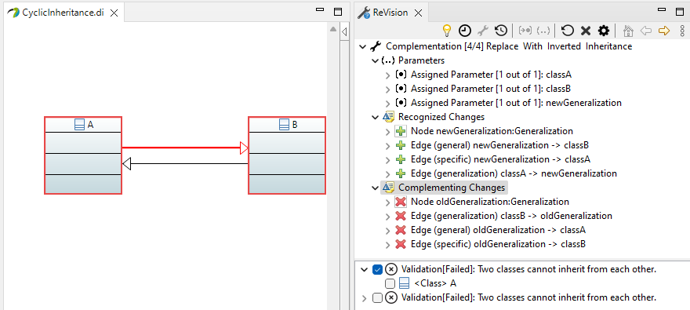

# Case-Study: UML 2.5 ReVision Configuration for Class Diagrams

This repository contains the configuration for the repair scenarios described below.
Moreover, it contains a single plug-in patch for the `ReVision` release for Eclipse 2022-09.

- `eclipse:` Contains the runtime plug-ins that can be copied into the Eclipse program folder in which `ReVision` is installed.
    - `dropins:` The edit rules and constraints plug-in JARs of the `ReVision` configuration.
    - `plugins:` The patched plug-in JAR file to be overwritten.
- `plugins:` The source codes of the `ReVision` configuration.
    - `com.github.repairvision.uml2v5.constraints.remzi:` The constraint configuration
    - `com.github.repairvision.uml2v5.editrules.remzi:` The edit rule configuration.
    - `com.github.repairvision.uml2v5.scenarios.remzi:` Scenarios with version history managed by Git.

## Minimal Scenario Examples

The scenarios and their related edit rules can be found in the `com.github.repairvision.uml2v5.editrules.remzi/scenario` folder.
In order to create scenarios with Papyrus you can create snapshots of the model by copying their project files.
Please note, the versions __have to be created ongoing__, i.e., do not create a new model for each model.
This is due to the UUIDs that Papyrus creates for each model element that allows us to easily identify corresponding model elements in each version.
(Alternatively, more advanced model matching techniques have to be installed/configured in the `ReVision` settings.)

In order to show changes in the model (which is modified by `ReVision`) in the class diagram, we have to enable Papyrus's `Sync with model` option in the Properties view (under `Appearance`).
Enable the option by selecting the diagram's canvas and for each class.

The scenarios with a version history maintained by Git can be found in `com.github.repairvision.uml2v5.scenarios.remzi`.
Assuming the plug-ins listed above are installed in Eclipse, you can use `ReVision` as described [here](https://repairvision.github.io/gettingstarted/).

## `ReVision` Developer Mode

To test `ReVision` with explicitly given model versions and edit rules, one can use the developer view.
Therefore, select the `Open Configuration` (cogwheel) icon in the `ReVision` view.
Under `Complementation -> User Interface` select `Repair Engine (developer)`.
This view allows you to add and remove edit rules and model versions for evaluation by drag'n'drop those into the corresponding fields.
Notably, the constraints must be installed to run the evaluation.
The constraint plug-in can be installed by exporting it to the dropins folder of Eclipse (see above, restart required) or by running an second Eclipse Application from the workspace containing the constraint plug-in (see [configuration](https://repairvision.github.io/configuration/)).

## Edit Rule Generation

The edit rules are in the `com.github.repairvision.uml2v5.editrules.remzi` plug-in folder.
The edit rules in `editrules` folder are generated from the minimal consistent modeling examples in the `examples` folder as described [here](https://repairvision.github.io/configuration/).

Based on the some filters/settings (`.model2graph`) the modeling examples are translated into the `patterns.graphpattern` file.
Notably, to make changes to the examples and regenerate the edit rules the patterns have to be deleted manually from this file.
For the `MissingAssociation` constraint, `<<exists>>` annotation are added to the `Classes` contained in the `Package` and their `ownedElement` references.
Such annotations tells the edit rule generator to always consider the classes as already existing context of the edit rules.
The concept is also described in [History-based Model Repair Recommendations](https://dl.acm.org/doi/pdf/10.1145/3419017).

The edit rule `ReplaceWithInvertedInheritance` is created manually, which implements the edit step as described in Scenario 2.
This edit rule is an adaption of the generated edit rule `RelocationInheritance` that moves a generalization between two classes.

A HTML documentation of the generated edit rules can be found in `doc` folder.
The `Henshin` graph transformation diagrams of the generated edit rules that are relevant to the scenarios can be found in the corresponding scenario folders.

## Scenario 1: The name of an attribute in a class must be unique.


The constraint `UniqueAttributeName` compares the names of all attributes in a class.

__FOL:__

```
constraint UniqueAttributeName
message "The name of an attribute in a class must be unique."
context Class self :
	forAll(Property attrA in self.ownedAttribute :
		forAll(Property attrB in self.ownedAttribute :
			not(isEqual(attrA, attrB))
			implies
			not(isEqual(attrA.name, attrB.name))))
```

__OCL:__

```
context Class inv:
self.ownedAttribute
  ->forAll(attrA| self.ownedAttribute
    ->forAll(attrB | attrA<>attrB implies (attrA.name<>attrB.name)))
```

A minimal example is shown in `scenarios/UniqueAttributeName`:

- _Model Version A_ (consistent older version): A class `A` with an attribute (property) `foo`.
    - `*.revisiondiff`: The model difference computed between model version `A` and `B` using the model elements' UUIDs for model matching.
- _Model Version B_ (inconsistent version): A class `A` with two attributes (properties) `foo`.
- _Model Version C_ (consistent newer version): Renamed the one of the attributes to `foo2`.

In principle, this scenario would also work without a modeling history.
In this case, `ReVision` assumes the _empty model_ as latest consistent version.
This also leads to a creation of the attributes `foo` that can be complemented accordingly.
The relevant edit rule and their repair recommendations for this scenario are:

- `CreateDataTypeAttributeInClass`: Overwriting the attribute `name` of the attributes creation for one of the attributes `foo`.

## Scenario 2: Two classes cannot inherit from each other.



The constraint `CyclicInheritance` states that if a class `A` inherits from a class `B`, class `B` cannot inherit from class `A`.

__FOL:__

```
constraint CyclicInheritance
message "Two classes cannot inherit from each other."
context Class self :
	forAll(Generalization generalizationA in self.generalization :
		forAll(Class superClass in generalizationA.general :
			not(exists(Generalization generalizationB in superClass.generalization :
					isEqual(generalizationB.general, self)))))
```

__OCL:__

```
context Class inv:
self.generalization
  ->forAll(generalizationA | generalizationA.general
    ->forAll(superClass | superClass.generalization
      ->not(exists(generalizationB | generalizationB.general = self))))
```

A minimal example is shown in `scenarios/CyclicInheritance`:

- _Model Version A_ (consistent older version): A class `A` that inherits from a class `B`.
    - `*.revisiondiff`: The model difference computed between model version `A` and `B` using the model elements' UUIDs for model matching.
- _Model Version B_ (inconsistent version): Adding a generalization from class `B` to class `A`.
- _Model Version C_ (consistent newer version): Removes the old generalization to achieve an inversion of the generalization relationship.

The constraint is actually violated with class `A` and with class `B` as context element, therefore, two inconsistencies are reported.
However, the proposed repair will be the same for both inconsistencies using the edit rule:

- `ReplaceWithInvertedInheritance:` `ReVision` recognizes the newly created generalization and suggests to remove the existing generalization to invert it.

This scenario requires a modeling history wrt. the given edit rule.
In fact, without a modeling history `ReVision` would assume both generalizations as created (starting from the _empty model_ ).
This is an edit step that is immediately syntactically incorrect and cannot be complemented, i.e., the edit step would have to be partially or fully undone, which is not supported by `ReVision`.
The complementation approach of `ReVision` do not allow to remove newly created model elements, i.e., one of the generalization, to create a repair.
Thus, the edit rule `ReplaceWithInvertedInheritance` could not be considered as a repair in this case.

## Scenario 3: An attribute with a class type must be represented by an association.


The constraint `MissingAssociation` checks all properties in class `A`. 
If a property has another class `B` as type (i.e., not a data type such as String or Integer), the property must be represented by an association. 
This can be checked by the outgoing reference `association` of the property. 
(Alternatively, we can check all associations in a model (i.e., `allInstances`), however, this is less efficient to evaluate.)

__FOL:__

```
constraint MissingAssociation
message "An attribute with a class type must be represented by an association."
context Class self :
	forAll(Property at in self.ownedAttribute :
		isInstanceOf(at.type, Class)
		implies
		exists(Association association in at.association :
			exists(Property end in association.memberEnd :
				isEqual(end.type, self))))
```

__OCL:__

```
context Class inv:
self.attribute
  ->forAll(at | at.type.oclIsKindOf(Class) implies at.type.association
    ->exists(association | 
      association.memberEnd.type->includes(at.type) 
      and
      association.memberEnd.type->includes(self)))
```

A minimal example is shown in `scenarios/MissingAssociation` and `\scenarios\MissingComposite`. UML creates an association by using two properties defining the features of the association's end. 
The properties can be owned by the classes or by the association. 
A association is navigable from class A to B if the corresponding property is owned by class A, and vice versa. 
The type of association, i.e., normal, shared, or composite, is determined by one of the properties (by its attribute `aggregation`). 

Therefore, the type of association that can be created by a repair of `ReVision` depends on the property that has been created in a class. 
Changing the type of the association, e.g., from normal to composite, is not a minimal repair and thus currently not considered by the repair approach. 
In principle, to make the repair suggestion more precise in terms of the edit rule's name, we could generate specific edit rules for normal, shared, and composite association.

- _Model Version A_ (consistent older version): 
Consists of two classes `A` and `B`.
    - `*.revisiondiff`: The model difference computed between model version `A` and `B` using the model elements' UUIDs for model matching.
- _Model Version B_ (inconsistent version): 
A property `b:B` is created in class `A`.
- _Model Version C_ (consistent newer version): 
A new association is created with the existing property `b:B` and a new property `a:A`.

In principle, this scenario would also work without a modeling history.
In this case, `ReVision` assumes the _empty model_ as latest consistent version.
This also leads to a creation of the property `b:B` that can be complemented accordingly.
The relevant edit rules and their repair recommendations for this scenario are:

- `CreateDirectionalNavigableAssociation:`
Association navigable from class `A` to `B`.
- `CreateNavigableAssociation:` 
Bidirectional navigable association (1) between `A` and `B`, and (2) between `B` and `A`. 
Actually, both recommendations result in the same repair - its just a flipped parameter mapping.
